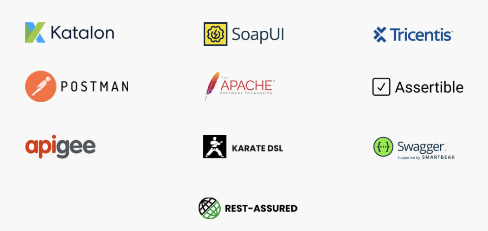

**1.Katalon Studio**

Katalon Studio is an automation tool for multiple applications, such as mobile, web, desktop, and API. It supports Rest and SOAP and empowers your team with CI/CD related integrations.
___
**2.SoapUI**

SoapUI is a dedicated and headless tool for functional testing, which empowers its users to test SOAP, Rest, and Web Services APIs without any hassle. It supports data-driven testing along with CI/CD integrations.

Additionally, you can reuse any test code created in SoapUI.
___
**3.Tricentis Tosca**

Tricentis Tosca is another amazing tool for DevOps and Agile. It supports various protocols such as TIBCO EMS, IBM MQ, etc. You can reuse the test code for test automation in this API testing tool too.
___
**4.Apigee**

Apigee is a fantastic API testing tool to test performance and measure the quality of the product. It also supports APIs created with the help of other applications like Apigee, Swagger, and more. Through this tool, you can track the API’s performance with error rates, API traffic, and response times measures.
___
**5.Postman**

Postman API testing is a browser plugin, which is now available for both Windows and Mac operating systems. It is excellent for testers and QA teams that are not interested in dealing with integrated development environment coding, the same language that the developers used.

API testing using Postman is easy and hassle-free for the QA team.
___
**6.JMeter**

JMeter was originally developed for load testing. But, it is often used for functional testing. It supports test result replay and dynamic performance testing of resources. On this tool, you can work with CSV files and find parameters for API tests.
___
**7.Rest-Assured**

With Rest-Assured, you can test Rest APIs with ease. It has multiple features, and the user doesn’t need to write code from scratch. The user doesn’t have to have expert-level knowledge of HTTP to use this API testing tool.
___
**8.Assertible**

The Assertible API testing tool is designed for reliability and automation. Through this tool, you can automate your API tests in the CI/CD pipeline. The QA team can also make specific changes to the tests, which would be automatically updated.
___
**9.Swagger**

Swagger API testing tool is perfect for performance, security, and functional testing. Its platform makes it easier for the QA team to manage, create, and use API tests in the CI/CD pipeline rather quickly.
___
**10.Karate DSL**

Karate is a stable and unique tool for API testing. It checks the performance of the product and self-writes step definitions in Karate. As the tool automatically manages that requirement, you can directly start testing your product.