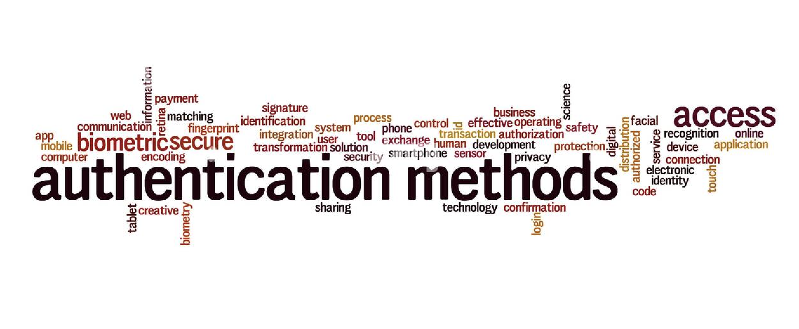

___

Sin contraseña o Passwordless.

Este es uno de los métodos modernos más prácticos. Un ejemplo de aplicación es el uso de un enlace mágico (magic link). Consiste en que, cada vez que quieras iniciar sesión a un recurso o servicio, se enviará a tu correo electrónico un enlace que te permitirá acceder sin necesidad de contraseña. 

Por redes sociales. 

Sin duda, ya habrás utilizado este método. Varias aplicaciones y servicios te dan como opción iniciar sesión directamente con alguna cuenta social.

Autenticación API. 

Este es el proceso de certificar la identidad de un usuario que quiera acceder a recursos y/o servicios en el servidor. Para tener en cuenta, alguna de las APIs de autenticación más populares son: autenticación básica por HTTP, de Core (núcleo) API y OAuth.

Autenticación Biométrica. 

Se vale de las huellas dactilares para validar la identidad del usuario.

___
