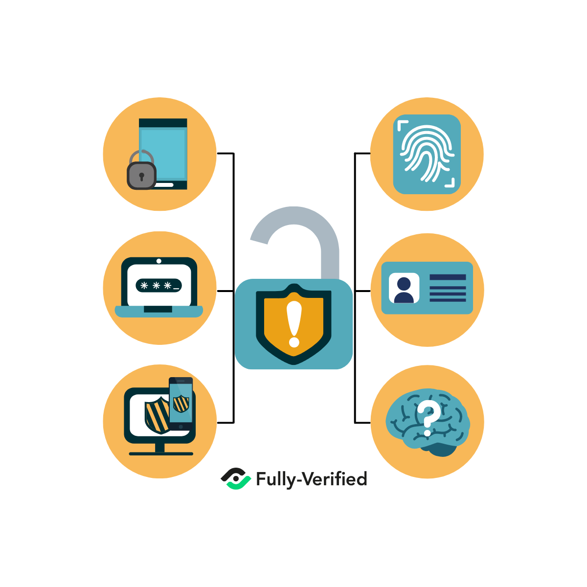

___

Autorización HTTP. 

Así como la autenticación, existe la autorización de tipo HTTP. ¿En qué consiste? La persona ingresa su nombre de usuario y contraseña para poder autenticarse. Es bueno tener presente que este método no implica a las cookies, IDs de sesiones o páginas de inicio de sesión.

Autorización API. 

Así como la autenticación, existe la autorización de tipo API. Cuando el usuario intenta ganar acceso a recursos de un sistema durante su registro, se genera una clave API. Esa misma clave se empareja con un token (una ficha identificadora) que se encuentra oculto. Entonces, esa combinación de clave API y token oculto es la que se utiliza constantemente cada vez que el usuario se autentica e ingresa a su entorno de recursos y servicios que puede utilizar.

OAuth 2.0. 

Este método permite que la API se autentique y acceda a los recursos del sistema que necesita. La versión 2.0 de OAuth es uno de los métodos más seguros tanto de autenticación como autorización.

Autorización JWT. 

Es un estándar abierto que se utiliza para la transmisión segura de datos entre distintas partes. Tiene soporte tanto para la autenticación como para la autorización. JWT es utilizada comúnmente para la autorización, y se vale un par de claves público-privada. Es decir, ese par contiene una clave privada y una pública.

____

HTTP/2: 

Pretende implantarse como un estándar en la web. Aunque no modifica semánticamente el protocolo anterior, sí incluye muchas mejoras que benefician tanto a usuarios como a cualquier persona que tenga una web. Por ejemplo, HTTP/2 incluye compresión, necesita menos recursos, lo que implica una menor latencia, el servidor puede responder a varias peticiones al mismo tiempo… En definitiva, mejoras que tienen como objetivo una Web más rápida y segura.

La principal diferencia entre HTTP y HTTPS es la seguridad. El protocolo HTTPS impide que otros usuarios puedan interceptar la información que se transfiere entre el cliente y el servidor web.
Sin contraseña o Passwordless.

Este es uno de los métodos modernos más prácticos. Un ejemplo de aplicación es el uso de un enlace mágico (magic link). Consiste en que, cada vez que quieras iniciar sesión a un recurso o servicio, se enviará a tu correo electrónico un enlace que te permitirá acceder sin necesidad de contraseña. 

Por redes sociales. 

Sin duda, ya habrás utilizado este método. Varias aplicaciones y servicios te dan como opción iniciar sesión directamente con alguna cuenta social.

Autenticación API. 

Este es el proceso de certificar la identidad de un usuario que quiera acceder a recursos y/o servicios en el servidor. Para tener en cuenta, alguna de las APIs de autenticación más populares son: autenticación básica por HTTP, de Core (núcleo) API y OAuth.

Autenticación Biométrica. 

Se vale de las huellas dactilares para validar la identidad del usuario.

___

Autorización HTTP. 

Así como la autenticación, existe la autorización de tipo HTTP. ¿En qué consiste? La persona ingresa su nombre de usuario y contraseña para poder autenticarse. Es bueno tener presente que este método no implica a las cookies, IDs de sesiones o páginas de inicio de sesión.

Autorización API. 

Así como la autenticación, existe la autorización de tipo API. Cuando el usuario intenta ganar acceso a recursos de un sistema durante su registro, se genera una clave API. Esa misma clave se empareja con un token (una ficha identificadora) que se encuentra oculto. Entonces, esa combinación de clave API y token oculto es la que se utiliza constantemente cada vez que el usuario se autentica e ingresa a su entorno de recursos y servicios que puede utilizar.

OAuth 2.0. 

Este método permite que la API se autentique y acceda a los recursos del sistema que necesita. La versión 2.0 de OAuth es uno de los métodos más seguros tanto de autenticación como autorización.

Autorización JWT. 

Es un estándar abierto que se utiliza para la transmisión segura de datos entre distintas partes. Tiene soporte tanto para la autenticación como para la autorización. JWT es utilizada comúnmente para la autorización, y se vale un par de claves público-privada. Es decir, ese par contiene una clave privada y una pública.

____

HTTP/2: 

Pretende implantarse como un estándar en la web. Aunque no modifica semánticamente el protocolo anterior, sí incluye muchas mejoras que benefician tanto a usuarios como a cualquier persona que tenga una web. Por ejemplo, HTTP/2 incluye compresión, necesita menos recursos, lo que implica una menor latencia, el servidor puede responder a varias peticiones al mismo tiempo… En definitiva, mejoras que tienen como objetivo una Web más rápida y segura.

La principal diferencia entre HTTP y HTTPS es la seguridad. El protocolo HTTPS impide que otros usuarios puedan interceptar la información que se transfiere entre el cliente y el servidor web.