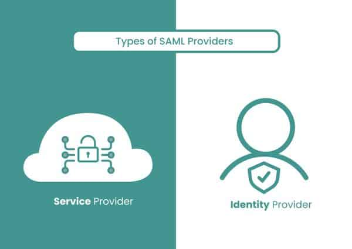

___

It is a standard which allows to users to access multiple web apps using same login credentials.

SAML is frequently used in SSO and is divided in 2:

**Identity  Providers:**

Responsible of identify and authenticate to the user.

- [x] LDAP
- [x] OKTA
- [x] Microsoft Azure Active Directory

**Service Providers:**

Is the web service provider or app in which the user want to access. 

- [x] AWS 
- [x] Salesforce
- [x] Microsft 365