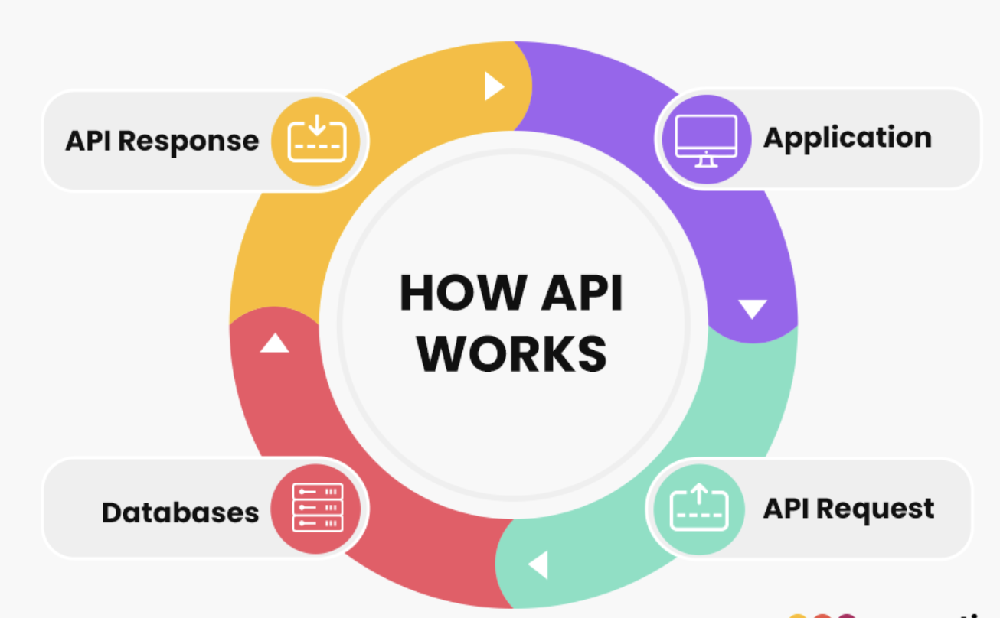

## **Basics of REST, SOAP and GraphQL**

### 1. **SOAP** - Simple Object Access Protocol 
SOAP operates with POST and GET as two of its basic functions. GET retrieves data from servers, while the developers use post to modify data or add extra information.

### 2. **REST**
REST requests to the Uniform Resource Identifier (URI) to alter the condition of the corresponding course.
Operations takes the shape of an HTTP method like GET, PUT, POST, DELETE, etc.

### 3. **GraphQL**
GraphQL is used to leverage two types of requests, including mutations that change data and queries that retrieve data from server.