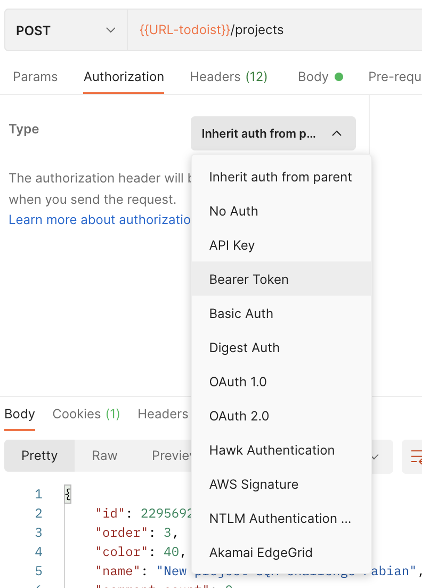

The user credentials are commonly send in ‘headers’
 
Cookies are sent as headers

### **Authorization types:**

* Inherit from parent
* No Auth
* API Key
* Bearer token 
* Oauth 1.0
* Oauth 2.0
* JSON Web Token (JWT)

____

