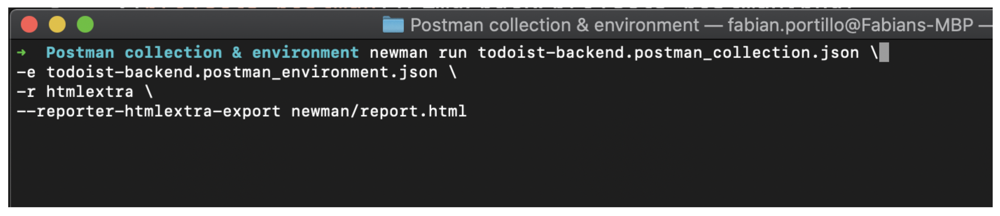
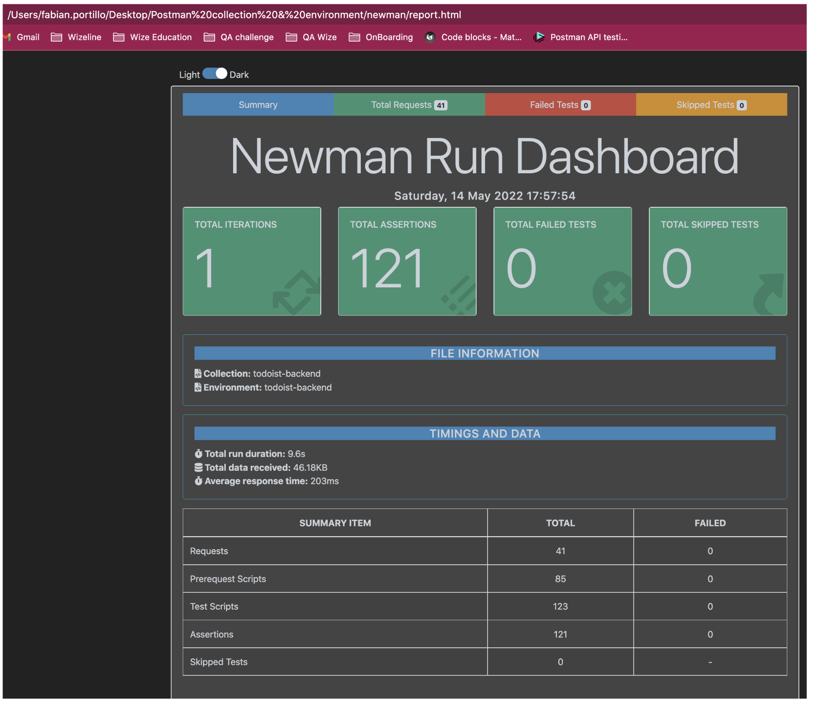
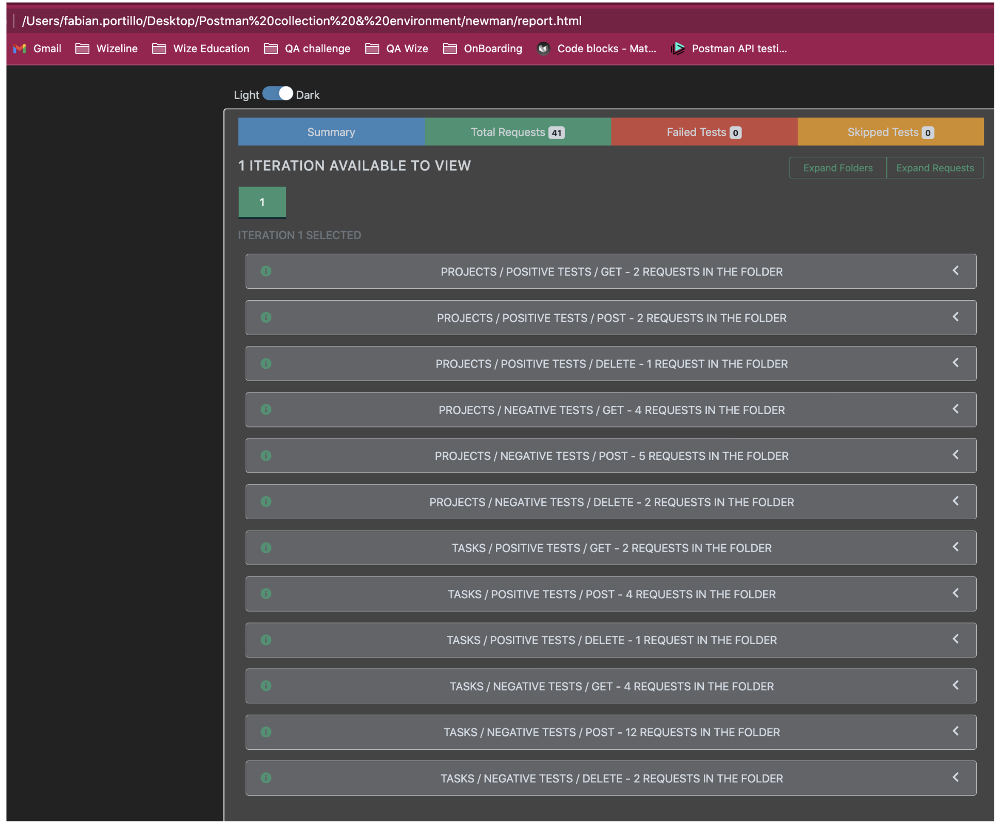

### **Prerequisites**

1. Export your collections and environment variables and save them in a folder of your computer.

2. Install newman and htmlextra in your computer.

3. Open your terminal inside the folder you created and run your collection using newman and htmlextra to verify everything is working and the HTML reports with the results were created.

### **Run Newman CLI**

___

### **Newman Dashboard reports**

